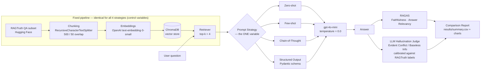

# Prompt Engineering Strategy Benchmark for RAG Pipelines

**B.Tech Project I (BCSE497J)** — A systematic comparison of **Zero-shot**, **Few-shot**,
**Chain-of-Thought**, and **Structured Output** prompting within a single, fixed
Retrieval-Augmented Generation (RAG) pipeline.

## 1. Problem Statement

RAG reduces hallucinations by grounding an LLM's answer in retrieved documents, but answer
quality still depends heavily on *how* the LLM is prompted with that retrieved context. This
project holds every other pipeline component fixed — chunking, embeddings, vector store,
top-k retrieval, base LLM, temperature — and varies **only the prompting strategy**, so that
any difference in accuracy, faithfulness, or hallucination rate can be attributed to the
prompt design itself.

## 2. Architecture



**Design principle:** everything left of the dashed boundary (retrieval) is built once
(`src/ingest.py`) and reused read-only by all four strategies. Everything right of it
(`src/prompts/*.py`) is the only thing that changes between experiment runs. This is what
makes the four numbers in the final report comparable.

## 3. Tech Stack

| Component | Choice |
|---|---|
| Orchestration | LangChain (LCEL) |
| Vector store | ChromaDB (persisted locally) |
| Embeddings | OpenAI `text-embedding-3-small` |
| Base LLM | `gpt-4o-mini`, temperature 0.0 |
| Structured output validation | Pydantic v2 |
| Evaluation | RAGAS (Faithfulness, Answer Relevancy) + custom LLM-judge |
| Dataset | [`wandb/RAGTruth-processed`](https://huggingface.co/datasets/wandb/RAGTruth-processed) (HF) |

## 4. Project Structure

```
project-1/
├── config.py                  # every control-variable constant lives here
├── requirements.txt
├── .env.example
├── src/
│   ├── data_loader.py          # RAGTruth -> eval set + calibration set + corpus
│   ├── ingest.py                # chunk -> embed -> Chroma (built once, shared)
│   ├── schemas.py               # Pydantic models (structured answer, judge output)
│   ├── prompts/
│   │   ├── zero_shot.py
│   │   ├── few_shot.py
│   │   ├── chain_of_thought.py
│   │   └── structured_output.py
│   ├── rag_chain.py             # LCEL orchestrator: retriever + LLM + strategy dispatch
│   ├── evaluate.py              # RAGAS wrapper + LLM hallucination judge + calibration
│   ├── run_benchmark.py         # main experiment runner (all 4 strategies)
│   └── generate_report.py       # results/summary.csv -> results/charts/*.png
├── scripts/
│   └── run_pipeline.py          # one-shot: data_loader -> ingest -> benchmark -> report
├── tests/                       # offline unit tests, no API key required
│   └── fixtures/ragtruth_fixture.jsonl
├── data/{raw,processed}/        # generated (gitignored)
└── results/{raw_outputs,charts}/  # generated (gitignored)
```

## 5. Setup

```powershell
python -m venv .venv
.venv\Scripts\Activate.ps1
pip install -r requirements.txt
copy .env.example .env      # then edit .env and set OPENAI_API_KEY
```

## 6. Running the Benchmark

Each stage is a standalone module so you can inspect/re-run any single step:

```powershell
# 1. Pull the RAGTruth QA subset, build eval + judge-calibration sets
python -m src.data_loader --sample-size 60 --calibration-size 30

# 2. Chunk -> embed -> index the shared corpus into Chroma (uses OpenAI embeddings)
python -m src.ingest

# 3. Run all 4 strategies over the eval set + grade every answer
python -m src.run_benchmark

# 4. Render the comparison charts
python -m src.generate_report
```

Or run everything in one command:

```powershell
python scripts/run_pipeline.py --sample-size 60
```

### Running without an OpenAI key / without internet

`python -m src.data_loader --fixture` uses a small bundled offline dataset
(`tests/fixtures/ragtruth_fixture.jsonl`, 20 hand-written QA rows in the same schema as
RAGTruth) instead of downloading from Hugging Face — useful for exercising the pipeline
end-to-end without network access. Steps 2 and 3 still require `OPENAI_API_KEY` since they
call the OpenAI embeddings/chat APIs; there is no offline substitute for those. Results
produced from the fixture are for **pipeline smoke-testing only** and should not be used in
the actual report.

### Running the tests (no API key required)

```powershell
pytest tests/ -v
```

Covers chunking behavior, the RAGTruth field-mapping/normalization logic (including the
train+test download, verified against the real dataset during development), prompt template
interpolation, chain-of-thought tag parsing, and Pydantic schema validation.

## 7. Dataset

[`wandb/RAGTruth-processed`](https://huggingface.co/datasets/wandb/RAGTruth-processed) —
17,790 rows (train + test) reprocessing the RAGTruth hallucination corpus. Each row has:
`id`, `query`, `context`, `output`, `task_type` (`QA` / `Summary` / `Data2txt`), `quality`,
`model`, `hallucination_labels` (raw per-span annotations), `hallucination_labels_processed`
(`{evident_conflict, baseless_info}` counts). We keep only `task_type == "QA"`
(5,934 rows) since it's the only subtype with a natural question to retrieve against.

`src/data_loader.py` splits the QA subset into:
- **`ragtruth_qa.jsonl`** — the benchmark eval set: `(query, reference_context,
  reference_answer)` triples that our own pipeline answers fresh.
- **`judge_calibration.jsonl`** — RAGTruth's own `(context, output, human hallucination
  labels)` triples, used only to calibrate the LLM judge (see §8).
- **`corpus.jsonl`** — the de-duplicated union of context passages, which is what
  `src/ingest.py` actually chunks/embeds/indexes. Our retrieval is built from scratch; we
  reuse RAGTruth's questions and gold passages, not its chunking or retrieval.

## 8. Evaluation Methodology

**Important design note:** RAGTruth's human hallucination labels were annotated on
responses from *its own* set of models (GPT-4, Llama, Mistral, ...), not on the fresh
answers our pipeline generates with `gpt-4o-mini` under 4 different prompting strategies. So
those labels can't be looked up directly for our new answers. Instead:

1. **Judge calibration** (`calibrate_judge` in `src/evaluate.py`): an LLM-as-judge
   (`gpt-4o-mini`, temperature 0.0) is prompted with RAGTruth's own label taxonomy
   (*Evident Conflict* / *Baseless Information* / *No Hallucination*) and run over the
   calibration set's **original** RAGTruth `(context, output)` pairs. Its predictions are
   compared against RAGTruth's human labels to report precision/recall/F1/accuracy — i.e.,
   "how much should we trust this judge?" — before using it for anything else.
2. **Grading our own answers**: the same judge, same taxonomy, same prompt, is then applied
   uniformly to the fresh answers each of the 4 strategies produces on the eval set. Because
   it's the *same* judge for every strategy, grading itself isn't a confound.
3. **RAGAS** (`compute_ragas_metrics`): reference-free **Faithfulness** (is the answer
   entailed by the retrieved context?) and **Answer Relevancy** (does the answer address the
   question?), computed per strategy as a second, independent signal.

### Metrics reported per strategy (`results/summary.csv`)

| Metric | Meaning |
|---|---|
| `accuracy` | judge-rated: does the answer correctly address the question? |
| `hallucination_rate` | judge-rated: fraction labeled Evident Conflict / Baseless Info |
| `ragas_faithfulness` | RAGAS: answer entailed by retrieved context (0-1) |
| `ragas_answer_relevancy` | RAGAS: answer addresses the question (0-1) |
| `avg_latency_seconds` | wall-clock time per generated answer |
| `avg_total_tokens` / `avg_cost_usd` | token usage / estimated cost per answer |

## 9. Visual Outputs

`python -m src.generate_report` renders to `results/charts/`:

- `accuracy.png`, `hallucination_rate.png`, `faithfulness.png` — one bar chart per metric,
  one bar per strategy.
- `accuracy_vs_hallucination.png` — grouped bars, accuracy vs. hallucination rate side by side.
- `latency.png`, `cost.png` — the efficiency trade-off side of the comparison.
- `radar_comparison.png` — all strategies overlaid on one radar (accuracy, faithfulness,
  answer relevancy, and *1 − hallucination_rate* so "further out" always means "better").

The architecture diagram in §2 and mock versions of these comparison charts are also
published as a companion visual artifact (see project chat) for a quick look before running
the real benchmark.

## 10. Expected Outcome

Chain-of-Thought and Structured Output are expected to reduce hallucination rate relative to
Zero-shot (forcing explicit claim-checking / verbatim-quote citation), at the cost of higher
token usage, latency, and $/query. Few-shot is expected to land between Zero-shot and the
other two on both axes. `results/summary.csv` and the charts in §9 are what confirm or
refute this once the benchmark is actually run against the full RAGTruth QA sample.

## 11. Known Limitations

- RAGAS's exact Python API has shifted across recent releases; `compute_ragas_metrics`
  catches and logs (rather than crashes on) API drift so one broken metric doesn't take down
  the whole benchmark run — check the console output if `ragas_*` columns are missing from
  `summary.csv`.
- The LLM hallucination judge is itself an LLM and is not perfectly accurate — that's exactly
  why §8's calibration step exists and why its precision/recall/F1 is reported alongside the
  main results, not hidden.
- `EVAL_SAMPLE_SIZE` / `CALIBRATION_SAMPLE_SIZE` in `config.py` default to 60 / 30 to keep
  API cost and runtime modest; increase them for a more statistically robust comparison.
